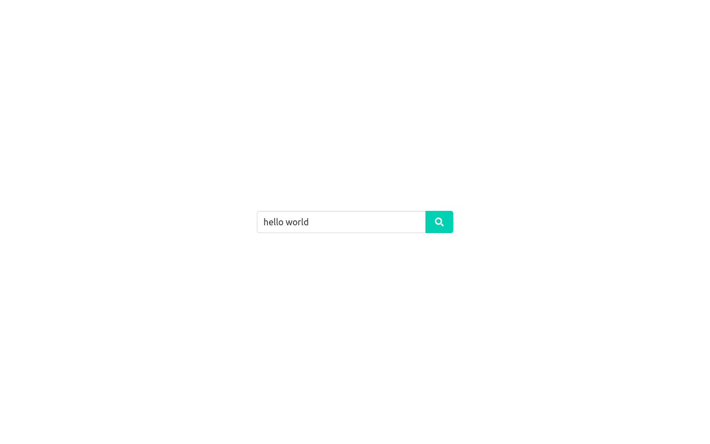
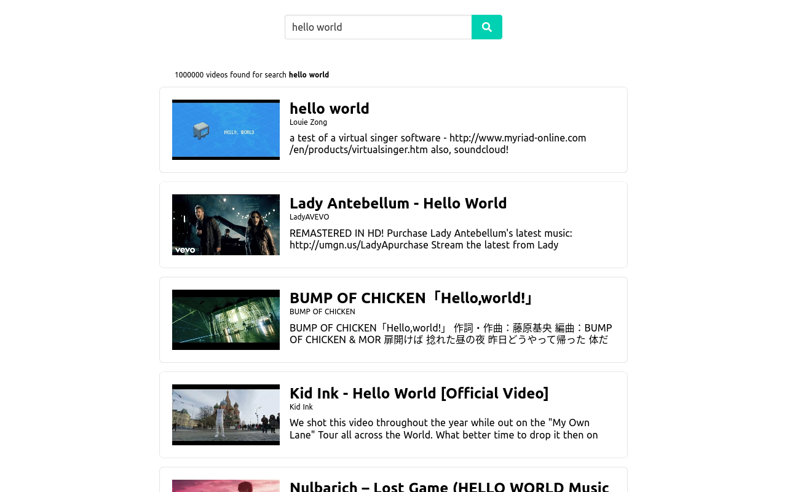
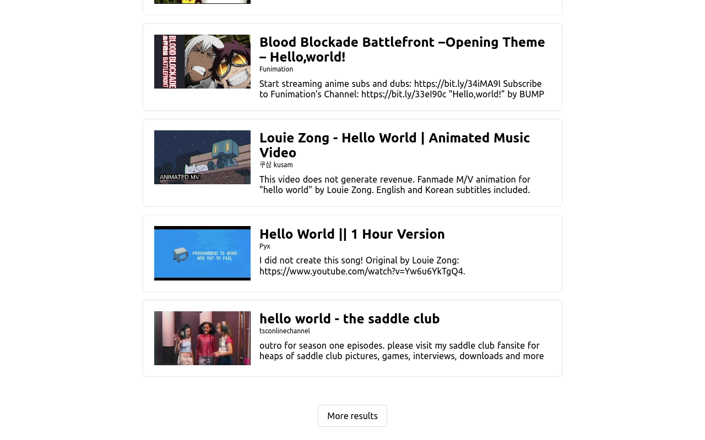
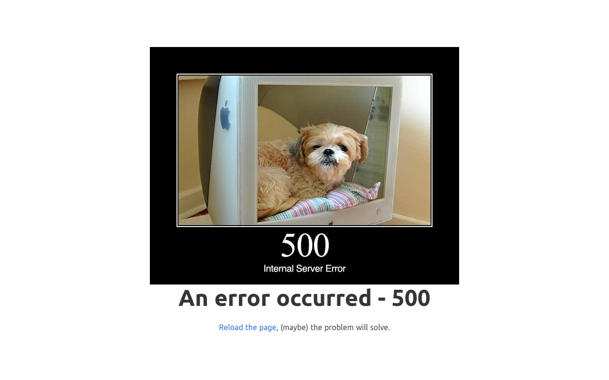

# option-challenge-front  
  

## About this  
  

Project of web app for visualization of search from YouTube API. Built on Nuxt (version 2.14).  
  

## Build Setup   
  

 ### Using local environment  
    

Requires Node (tested on version 13) and Yarn  
  

```bash  
# install dependencies  
$ yarn install  
# serve with hot reload at localhost:3333  
$ yarn dev  
# build for production and launch server  
$ yarn build  
$ yarn start  
# generate static project  
$ yarn generate  
```  
  

 ### Using Docker Compose (Recommended)  
  

Requires Docker-CE (tested on version 20) and Docker Compose  (tested on version 1.27.4)  
  

```bash  
# build image  
$ docker-compose build  
# run detached  
$ docker-compose up -d  
```  
  

## Environment values  
  

Set this values in the `.env` file at root folder before start the run-time:  
  

| Value | Description | Default |  
|-------|-------------|---------|  
| URL_API | URL of the API to consume resources |  http://localhost:3000  |  

## Brief of development process

* Docker was used to isolate the project and dependences from the system and other projects (like the front end). Also, is more easy to deploy and run with Docker Compose (build and up).
* Nuxt was chosen by their ease of use: create a project, organize the files and import then.
* For the styles, [Bulma](bulma.io) was used with Sass as CSS lang.  Also, for the HTML template was used Pug.
* Some parts of view has been refined: 
	* Form input should have text 
	* Blocked triggers of buttons and forms when is loading to avoid perform double requests
	* Page is responsive from mobile to desktop 
* The view are spited and nested in components with defined tasks. 
* The data fetched from the API is stored in the the state management pattern (Vuex), so the page only can trigger actions thought *dispatch* and cannot modify the data.
* Axios can manage request to the API Rest, especially with CORS - necessary to get the data from external domains.
* The lack of test files on this project is because I cannot run tests of index page, where the Jest cannot get the main Nuxt variable (`$this`) used in scripts of components (WIP).

## Usage  
  

  
  

To start to search, type the term to search, and then press *enter* or the tap the *search button*.  
  
  

A list of result will appear. To load more results, scroll and tap the button *More results*  
  

  
  

In case of error, a page with the code will rise.

  
  

> Written with [StackEdit](https://stackedit.io/).
