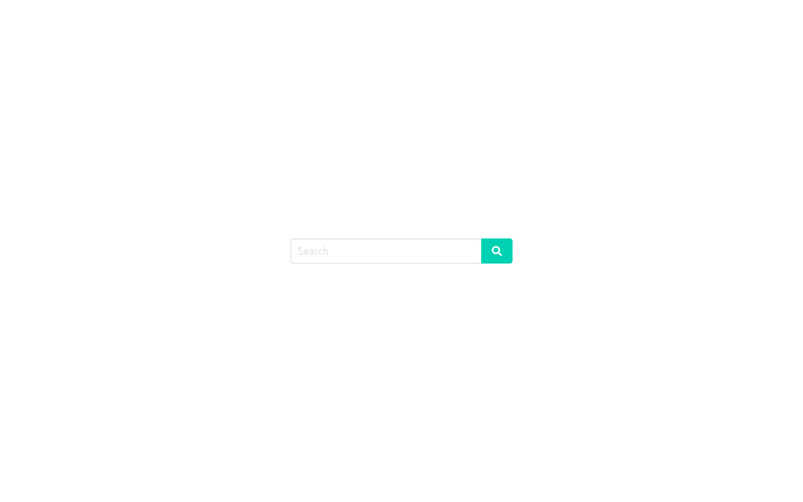

# option-challenge-front  
  

## About this  
  

Project of web app for visualization of search from YouTube API. Built on Nuxt (version 2.14).  
  

## Build Setup   
  

 ### Using local environment  
    

Requires Node (tested on version 13) and Yarn  
  

```bash  
# install dependencies  
$ yarn install  
# serve with hot reload at localhost:3333  
$ yarn dev  
# build for production and launch server  
$ yarn build  
$ yarn start  
# generate static project  
$ yarn generate  
```  
  

 ### Using Docker Compose (Recommended)  
  

Requires Docker-CE (tested on version 20) and Docker Compose  (tested on version 1.27.4)  
  

```bash  
# build image  
$ docker-compose build  
# run detached  
$ docker-compose up -d  
```  
  

## Environment values  
  

Set this values in the `.env` file at root folder before start the run-time:  
  

| Value | Description | Default |  
|-------|-------------|---------|  
| URL_API | URL of the API to consume resources |  http://localhost:3000  |  
  

## Usage  
  

  
  

To start to search, type the term to search, and then press *enter* or the tap the *search button*.  
  
  

A list of result will appear. To load more results, scroll and tap the button *More results*  
  

  
  
  

> Written with [StackEdit](https://stackedit.io/).
